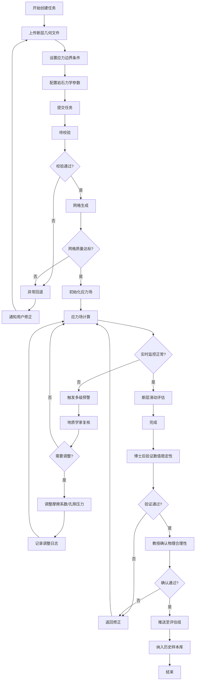

## 1. 产品概述

地壳应力场模拟与断层滑动预测平台是面向地质学家、地震研究人员和危险性评估团队的专业科研平台。用户上传断层几何文件、应力边界条件和岩石力学参数后，系统自动完成三维有限元网格生成、应力场初始化、断层滑动评估等完整模拟流程，并生成可视化分析报告。平台内置多级预警、两级审批、智能参数推荐和异常偏差检测机制，为地震危险性评估提供科学、可靠的数据支撑。

- **核心目标**：实现全自动化、高可靠性的地壳应力模拟与断层滑动预测工作流
- **解决问题**：传统手动模拟流程繁琐、参数调优依赖经验、结果审核缺乏标准化
- **目标用户**：地质学家、博士后研究员、教授、首席科学家、地震危险性评估组
- **产品价值**：将模拟效率提升5-10倍，通过智能推荐优化参数精度，建立标准化审批流程确保结果可靠性

## 2. 核心功能

### 2.1 用户角色

| 角色 | 注册方式 | 核心权限 |
|------|----------|----------|
| 地质学家 | 系统创建 | 上传数据、创建任务、查看模拟、响应预警、复核调整参数 |
| 博士后 | 系统创建 | 验证模拟数值稳定性、提交审批 |
| 教授 | 系统创建 | 确认物理合理性、终审通过 |
| 首席科学家 | 系统创建 | 接收偏差预警、解除断层暂停、全局配置管理 |
| 评估组成员 | 系统创建 | 查看已审批通过的模拟结果、导出数据 |
| 系统管理员 | 系统创建 | 用户管理、系统配置、日志审计 |

### 2.2 功能模块

1. **综合看板**：每日统计指标、性能趋势图、任务概览、预警概览
2. **模拟任务中心**：任务列表、任务创建、状态追踪、详情查看
3. **模拟监控台**：实时应力曲线、剪应力/库仑应力监控、进度可视化
4. **预警中心**：多级预警列表、预警详情、复核操作、预警日志
5. **审批中心**：待审批列表、数值稳定性验证、物理合理性确认、审批历史
6. **结果报告**：应力场云图、断层滑动势分布、地震矩释放曲线、库仑应力动画、数据导出
7. **智能推荐**：参数推荐历史、最优组合匹配、推荐效果追踪
8. **断层管理**：断层档案、偏差检测记录、暂停状态管理
9. **用户与权限**：角色管理、权限分配、操作日志

### 2.3 页面详情

| 页面名称 | 模块名称 | 功能描述 |
|-----------|-------------|---------------------|
| 综合看板 | 统计指标卡片 | 展示模拟完成率、平均精度、预警响应时间、进行中任务数 |
| 综合看板 | 性能趋势图 | 30天完成率趋势、精度变化曲线、预警响应时间趋势 |
| 综合看板 | 任务概览 | 各状态任务数量统计饼图、今日新增任务 |
| 综合看板 | 预警概览 | 活跃预警列表、按严重程度分类 |
| 任务中心 | 任务列表 | 分页、筛选（状态/断层/创建人/时间）、搜索、排序 |
| 任务中心 | 创建任务向导 | 四步向导：上传断层文件→设置边界条件→配置力学参数→确认提交 |
| 任务中心 | 任务详情 | 状态时间线、参数配置、监控数据、报告预览、调整日志 |
| 任务中心 | 状态流转可视化 | 待校验→网格生成→初始化→应力计算→滑动评估→完成 流程动画 |
| 模拟监控台 | 实时数据流 | 最大剪应力实时曲线、库仑应力变化曲线、滑动速率监控 |
| 模拟监控台 | 三维可视化 | 有限元网格渲染、应力云图叠加、断层高亮显示 |
| 模拟监控台 | 阈值指示器 | 摩擦强度基准线、预警阈值线、异常点标注 |
| 预警中心 | 预警列表 | 按级别（一级/二级/三级）筛选，预警状态（待复核/已处理/已忽略） |
| 预警中心 | 预警详情 | 触发条件、异常数值、影响范围、历史同类预警 |
| 预警中心 | 复核操作 | 调整摩擦系数、调整孔隙压力、确认无异常、记录复核意见 |
| 审批中心 | 待审批列表 | 按角色区分（博士后待验证/教授待确认）、任务信息摘要 |
| 审批中心 | 数值稳定性验证 | 收敛曲线、残差分析、质量指标评分、验证意见填写 |
| 审批中心 | 物理合理性确认 | 参数合理性、结果符合地质常识、专业判断意见填写 |
| 审批中心 | 审批历史 | 全部审批记录、审批人、时间、意见可追溯 |
| 结果报告 | 报告概览 | 任务元信息、模拟摘要、关键指标卡片 |
| 结果报告 | 应力场云图 | 三维/剖面视图、色阶、切换主应力/剪应力/库仑应力 |
| 结果报告 | 断层滑动势分布 | 沿断层走向分布图、高风险段标注 |
| 结果报告 | 地震矩释放曲线 | 时间序列曲线、累积释放量、关键事件标记 |
| 结果报告 | 库仑应力演化动画 | 时间轴播放、暂停/播放、速度调节、帧跳转 |
| 结果报告 | 数据导出 | 按断层段/应力源/时间窗口筛选，导出应力张量/滑动数据(CSV/JSON) |
| 结果报告 | PDF生成下载 | 一键生成包含全部图表的综合报告PDF |
| 智能推荐 | 推荐面板 | 基于当前断层/参数的历史匹配最优组合推荐 |
| 智能推荐 | 推荐历史 | 推荐记录、采纳情况、实际效果对比 |
| 智能推荐 | 参数敏感性分析 | 各参数对结果的影响权重可视化 |
| 断层管理 | 断层档案库 | 断层基本信息、几何特征、历史模拟次数、暂停状态 |
| 断层管理 | 偏差检测记录 | 连续偏差事件详情、偏差百分比、触发时间、处理记录 |
| 断层管理 | 暂停管理 | 暂停原因、暂停时间、解除操作、首席科学家审批 |

## 3. 核心流程

### 3.1 模拟任务主流程

地质学家登录系统后，在任务中心通过向导上传断层几何文件、配置应力边界条件和岩石力学参数，提交后任务进入"待校验"状态。系统自动校验文件格式和参数完整性，通过后依次流转至"网格生成→初始化→应力场计算→断层滑动评估"，每步由系统自动执行并实时监控最大剪应力和库仑应力变化。若剪应力超过摩擦强度或滑动速率异常则触发多级预警推送至地质学家复核，复核通过则自动调整摩擦系数或孔隙压力重新模拟并记录日志。正常完成后进入"完成"状态，等待博士后验证数值稳定性，验证通过后提交教授确认物理合理性，两级审批通过后自动推送至地震危险性评估组，同时纳入智能推荐引擎的历史样本库。

### 3.2 偏差检测与暂停流程

系统自动监测同一断层的连续模拟结果，当滑动量预测偏差超过20%累计达到三次时，自动触发断层暂停机制，暂停该断层所有新任务创建，系统立即发送通知至首席科学家。首席科学家收到通知后，查看偏差详情和历史模拟对比，组织专家会诊后决定解除暂停（允许继续任务）或要求补充基础数据（更新断层参数后再开启）。

### 3.3 每日统计流程

系统每日凌晨00:00自动触发统计任务，计算过去24小时及30天窗口内的模拟完成率、平均应力预测精度、预警响应时间等指标，生成包含性能趋势图的综合看板，所有用户登录后首先看到最新的统计数据。

## 4. 用户界面设计

### 4.1 设计风格

- **主色调**：深邃科技蓝（#165DFF）作为主色，搭配地质安全橙（#FF7D00）作为预警强调色
- **辅助色**：成功绿（#00B42A）、危险红（#F53F3F）、信息青（#14C9C9）、中性灰阶（#1D2129 → #F2F3F5）
- **按钮风格**：圆角8px，主按钮带细微渐变，hover时上浮2px+阴影增强，点击回弹效果
- **字体**：标题采用思源黑体Bold，正文采用思源雅黑Regular，等宽数据展示使用JetBrains Mono
- **布局风格**：左侧导航栏固定+顶部状态栏+内容区卡片式布局，高信息密度但层次清晰
- **图标风格**：Lucide线性图标，统一1.5px线宽，预警类图标搭配背景圆点增加识别度
- **整体基调**：专业科研级深色主题（#0F172A背景），搭配发光数据卡片和微妙渐变，营造精准可靠的科学计算氛围

### 4.2 页面设计概述

| 页面名称 | 模块名称 | UI元素 |
|-----------|-------------|-------------|
| 综合看板 | 统计指标卡片 | 深色玻璃拟态卡片，大字号数据+小字号环比，图标发光效果，趋势微折线嵌入卡片右下角 |
| 综合看板 | 性能趋势图 | 深色Chart.js画布，面积渐变填充，多Y轴对齐，数据点hover显示详情tooltip |
| 综合看板 | 任务概览 | 环形进度图（各状态占比），下方任务列表带状态色标签 |
| 任务中心 | 任务列表 | 斑马行表格，状态列使用带发光效果的胶囊标签，行hover展开快捷操作 |
| 任务中心 | 创建向导 | 步骤指示器（连接带发光动画），大区域拖拽上传，参数分组折叠面板 |
| 模拟监控台 | 实时曲线 | ECharts实时流式更新，阈值线红色虚线，异常点脉冲动画标记 |
| 模拟监控台 | 三维视窗 | WebGL渲染区域，鼠标拖拽旋转，右侧图例+色阶，底部播放控制条 |
| 预警中心 | 预警卡片 | 按严重程度边框色区分（一级红/二级橙/三级黄），左侧色条+图标脉冲 |
| 审批中心 | 审批卡片 | 顶部角色徽章，参数对比折叠区，底部意见输入框+审批按钮组 |
| 结果报告 | 图表区 | 四宫格布局，每张图支持点击放大查看，右上角工具栏（导出/全屏/设置） |
| 智能推荐 | 推荐面板 | 卡片式推荐项，Top1带皇冠标识+高亮边框，采纳率进度条 |

### 4.3 响应性

- **设计策略**：桌面优先（Desktop-first），针对科研场景主要在1920×1080及以上分辨率优化
- **大屏适配**：2K/4K屏幕下网格自动扩展，图表容器自适应填充
- **中等屏幕**：1366×768笔记本，侧边栏可折叠，表格启用横向滚动
- **小屏兼容**：平板尺寸（≥768px）采用顶部导航+内容堆叠布局，隐藏次要图表
- **触控优化**：所有可点击元素最小尺寸44×44px，滑动手势支持时间轴缩放

### 4.4 3D场景指导（应力场三维可视化）

- **环境/HDRI氛围**：纯深色背景（#0A0E1A），叠加微弱宇宙噪点纹理，营造地下探测沉浸感
- **光照设置**：主光源从45°斜上方照射（强度1.2），边缘轮廓光勾勒断层边界（蓝色调0.6强度），环境光遮蔽(SSAO)增加立体感
- **相机设置**：初始正交透视视角，可切换透视/正交，默认距离包含整个模型的1.2倍范围
- **构图与焦点**：断层模型位于画面中心略偏左，右侧留白放置色阶图例，关键高应力区域自动添加标注框
- **交互与动画**：拖拽旋转、滚轮缩放、右键平移；应力变化时色阶过渡动画（0.5s缓动）；播放时间序列时相机自动跟随高应力区移动
- **后处理效果**：轻微Bloom让高值区域发光，FXAA抗锯齿，暗角效果聚焦中心
- **资产与性能**：使用Three.js + InstancedMesh渲染网格单元，单帧draw call控制在200以内，移动端降级为切片2.5D视图
