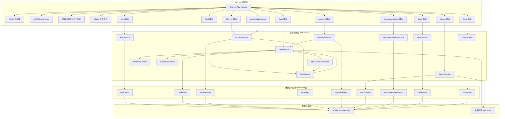
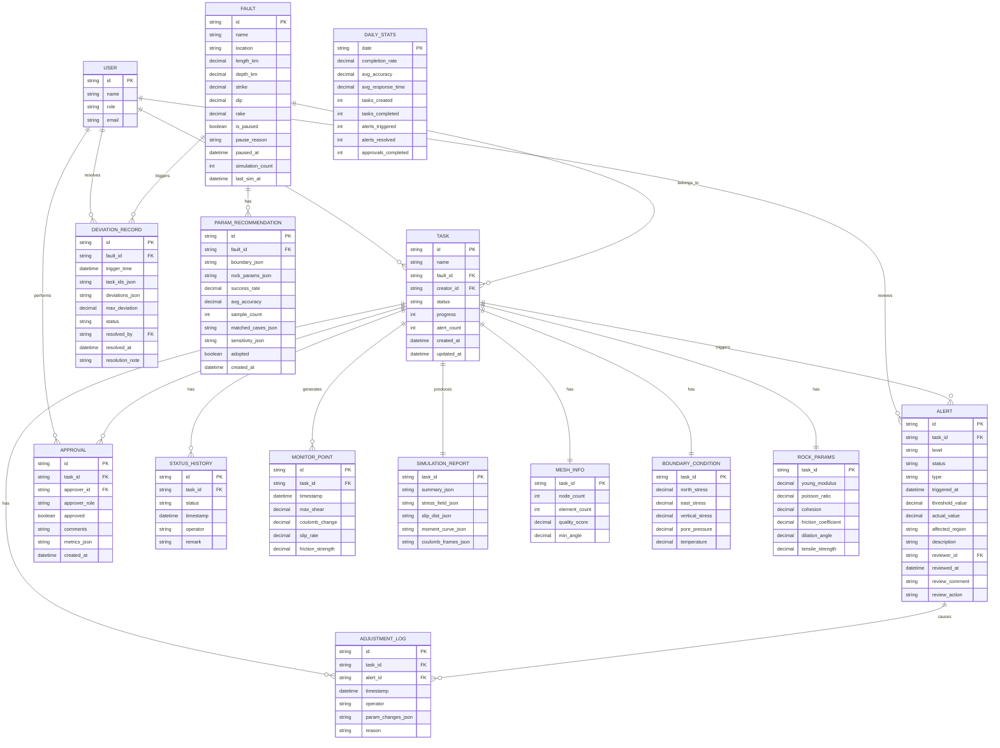

## 1. 架构设计

```mermaid
graph TB
    subgraph "用户层"
        U1["地质学家"]
        U2["博士后"]
        U3["教授"]
        U4["首席科学家"]
        U5["评估组成员"]
    end

    subgraph "前端展示层 (React 18 + TypeScript)"
        P1["综合看板 Dashboard"]
        P2["任务中心 TaskCenter"]
        P3["模拟监控台 Monitor"]
        P4["预警中心 AlertCenter"]
        P5["审批中心 Approval"]
        P6["结果报告 Report"]
        P7["智能推荐 Engine"]
        P8["断层管理 FaultMgr"]
    end

    subgraph "API网关层 (Express.js)"
        A1["RESTful API"]
        A2["WebSocket实时推送"]
        A3["文件上传处理"]
        A4["鉴权中间件"]
    end

    subgraph "业务服务层"
        S1["任务状态机服务"]
        S2["网格生成服务"]
        S3["应力计算模拟服务"]
        S4["实时监控服务"]
        S5["预警引擎服务"]
        S6["审批工作流服务"]
        S7["报告生成服务"]
        S8["智能推荐引擎"]
        S9["偏差检测服务"]
        S10["统计分析服务"]
    end

    subgraph "数据存储层"
        D1["SQLite 关系数据库"]
        D2["文件存储 (本地FS)"]
        D3["Zustand 前端状态"]
        D4["内存缓存 (Node-cache)"]
    end

    subgraph "外部依赖"
        E1["Three.js 3D渲染"]
        E2["ECharts 图表库"]
        E3["jsPDF 报告生成"]
        E4["Lucide 图标库"]
        E5["TailwindCSS 样式"]
    end

    U1 & U2 & U3 & U4 & U5 --> P1 & P2 & P3 & P4 & P5 & P6 & P7 & P8
    P1 & P2 & P3 & P4 & P5 & P6 & P7 & P8 --> A1 & A2 & A3
    A1 & A2 & A3 & A4 --> S1 & S2 & S3 & S4 & S5 & S6 & S7 & S8 & S9 & S10
    S1 & S2 & S3 & S4 & S5 & S6 & S7 & S8 & S9 & S10 --> D1 & D2 & D4
    P1 & P2 & P3 & P4 & P5 & P6 & P7 & P8 --> D3
    P3 & P6 --> E1
    P1 & P3 & P6 & P7 --> E2
    P6 --> E3
    P1 & P2 & P3 & P4 & P5 & P6 & P7 & P8 --> E4 & E5
```



## 2. 技术说明

- **前端**: React@18 + TypeScript + Vite@5 + React Router@6 + Zustand@4 + TailwindCSS@3
- **初始化工具**: vite-init (react-express-ts 模板)
- **后端**: Express@4 + TypeScript + CORS中间件
- **数据库**: SQLite3 + better-sqlite3 (文件型数据库，无需额外服务)
- **实时通信**: ws (WebSocket库) 用于应力监控实时数据推送
- **3D可视化**: Three.js + @react-three/fiber + @react-three/drei
- **图表库**: ECharts@5 + echarts-for-react
- **报告生成**: jspdf + html2canvas
- **HTTP客户端**: axios
- **文件上传**: multer 中间件
- **数据 Mock**: 内置模拟数据生成器，无真实计算引擎时展示完整流程

## 3. 路由定义

### 3.1 前端路由 (React Router)

| 路由路径 | 页面组件 | 用途 |
|----------|----------|------|
| /dashboard | DashboardPage | 综合看板首页（默认首页） |
| /tasks | TaskListPage | 模拟任务列表 |
| /tasks/create | TaskCreatePage | 创建模拟任务向导 |
| /tasks/:id | TaskDetailPage | 任务详情页（含状态时间线） |
| /monitor/:id | MonitorPage | 模拟监控台（实时数据+3D视图） |
| /alerts | AlertListPage | 预警中心列表 |
| /alerts/:id | AlertDetailPage | 预警详情与复核操作 |
| /approvals | ApprovalListPage | 审批中心（按角色分流） |
| /approvals/postdoc/:id | PostdocApprovalPage | 博士后数值稳定性验证 |
| /approvals/professor/:id | ProfessorApprovalPage | 教授物理合理性确认 |
| /report/:id | ReportPage | 结果报告与数据导出 |
| /recommendations | RecommendationPage | 智能推荐引擎面板 |
| /faults | FaultListPage | 断层档案管理 |
| /faults/:id | FaultDetailPage | 断层详情（含偏差历史） |
| /settings | SettingsPage | 系统设置与用户管理 |
| /login | LoginPage | 登录页（角色选择登录） |

### 3.2 后端API路由

| 方法 | 路由 | 用途 |
|------|------|------|
| POST | /api/auth/login | 用户登录（角色模拟） |
| GET | /api/dashboard/stats | 获取看板统计指标 |
| GET | /api/dashboard/trends | 获取30天趋势数据 |
| GET | /api/tasks | 获取任务列表（支持筛选分页） |
| POST | /api/tasks | 创建模拟任务 |
| GET | /api/tasks/:id | 获取任务详情 |
| PUT | /api/tasks/:id/status | 更新任务状态（状态机流转） |
| DELETE | /api/tasks/:id | 删除任务（仅草稿状态） |
| POST | /api/tasks/upload | 上传断层几何文件 |
| GET | /api/tasks/:id/monitor | 获取监控数据快照 |
| WS | /ws/tasks/:id/stream | WebSocket 实时监控数据流 |
| GET | /api/alerts | 获取预警列表 |
| GET | /api/alerts/:id | 获取预警详情 |
| POST | /api/alerts/:id/review | 提交预警复核意见 |
| GET | /api/approvals/pending | 获取当前用户待审批列表 |
| POST | /api/approvals/postdoc/:taskId | 提交博士后验证 |
| POST | /api/approvals/professor/:taskId | 提交教授确认 |
| GET | /api/report/:taskId | 获取报告数据（图表数据） |
| POST | /api/report/:taskId/export | 导出数据（CSV/JSON） |
| GET | /api/report/:taskId/pdf | 生成并下载PDF报告 |
| GET | /api/recommendations/:faultId | 获取参数推荐 |
| POST | /api/recommendations/:id/adopt | 采纳推荐参数 |
| GET | /api/faults | 获取断层列表 |
| GET | /api/faults/:id | 获取断层详情（含偏差记录） |
| POST | /api/faults/:id/resume | 首席科学家解除断层暂停 |
| GET | /api/stats/daily | 获取每日统计记录 |

## 4. API数据类型定义

```typescript
// ====== 通用枚举 ======
export type TaskStatus = 
  | 'pending_verify'      // 待校验
  | 'mesh_generating'     // 网格生成中
  | 'initializing'        // 初始化中
  | 'stress_computing'    // 应力场计算中
  | 'slip_evaluating'     // 断层滑动评估
  | 'completed'           // 完成（待审批）
  | 'rollback'            // 异常回退
  | 'postdoc_approved'    // 博士后已验证
  | 'professor_approved'  // 教授已确认
  | 'published';          // 已推送评估组

export type AlertLevel = 'level1' | 'level2' | 'level3'; // 一级/二级/三级
export type AlertStatus = 'pending' | 'reviewed' | 'ignored';
export type Role = 'geologist' | 'postdoc' | 'professor' | 'chief' | 'assessor' | 'admin';
export type StressType = 'principal' | 'shear' | 'coulomb';

// ====== 用户 ======
export interface User {
  id: string;
  name: string;
  role: Role;
  email: string;
  avatar?: string;
}

// ====== 模拟任务 ======
export interface SimulationTask {
  id: string;
  name: string;
  faultId: string;
  faultName: string;
  creatorId: string;
  creatorName: string;
  status: TaskStatus;
  statusHistory: StatusRecord[];
  createdAt: string;
  updatedAt: string;
  geometryFile: FileInfo;
  boundaryConditions: BoundaryConditions;
  rockParams: RockMechanicsParams;
  meshInfo?: MeshInfo;
  progress: number; // 0-100
  currentStep?: string;
  alertCount: number;
  adjustmentLogs: AdjustmentLog[];
}

export interface StatusRecord {
  status: TaskStatus;
  timestamp: string;
  operator?: string;
  remark?: string;
}

export interface FileInfo {
  id: string;
  name: string;
  size: number;
  type: string;
  uploadedAt: string;
}

export interface BoundaryConditions {
  northStress: number;    // 北向应力 (MPa)
  eastStress: number;     // 东向应力 (MPa)
  verticalStress: number; // 垂向应力 (MPa)
  porePressure: number;   // 孔隙压力 (MPa)
  temperature: number;    // 温度 (°C)
}

export interface RockMechanicsParams {
  youngModulus: number;    // 杨氏模量 (GPa)
  poissonRatio: number;    // 泊松比
  cohesion: number;        // 内聚力 (MPa)
  frictionCoefficient: number; // 摩擦系数
  dilationAngle: number;   // 剪胀角 (°)
  tensileStrength: number; // 抗拉强度 (MPa)
}

export interface MeshInfo {
  nodeCount: number;
  elementCount: number;
  qualityScore: number;    // 0-100
  minAngle: number;        // 最小单元角
}

export interface AdjustmentLog {
  id: string;
  timestamp: string;
  operator: string;
  alertId?: string;
  paramChanges: Partial<RockMechanicsParams & BoundaryConditions>;
  reason: string;
}

// ====== 监控与预警 ======
export interface MonitorDataPoint {
  timestamp: string;
  maxShearStress: number;      // 最大剪应力 MPa
  coulombStressChange: number; // 库仑应力变化 MPa
  slipRate: number;            // 滑动速率 mm/yr
  frictionStrength: number;    // 摩擦强度 MPa
  temperature?: number;
}

export interface Alert {
  id: string;
  taskId: string;
  taskName: string;
  level: AlertLevel;
  status: AlertStatus;
  type: 'shear_exceed' | 'slip_anomaly' | 'convergence_warning';
  triggeredAt: string;
  thresholdValue: number;
  actualValue: number;
  affectedRegion: string;
  description: string;
  reviewerId?: string;
  reviewedAt?: string;
  reviewComment?: string;
  reviewAction?: 'adjust_friction' | 'adjust_pore' | 'confirm_normal';
}

// ====== 审批 ======
export interface ApprovalRecord {
  id: string;
  taskId: string;
  approverId: string;
  approverName: string;
  approverRole: 'postdoc' | 'professor';
  approved: boolean;
  comments: string;
  numericalStability?: {
    convergenceRate: number;
    residualNorm: number;
    massConservation: number;
    overallScore: number; // 0-100
  };
  physicalReasonability?: {
    paramConsistency: number;
    geologicalPlausibility: number;
    resultAgreement: number;
    overallScore: number;
  };
  createdAt: string;
}

// ====== 报告结果 ======
export interface SimulationReport {
  taskId: string;
  summary: {
    maxPrincipalStress: number;
    maxShearStress: number;
    totalSeismicMoment: number;
    maxSlipPotential: number;
    highRiskSegments: string[];
  };
  stressFieldData: StressFieldPoint[];
  slipDistribution: SlipPoint[];
  seismicMomentCurve: MomentPoint[];
  coulombEvolution: CoulombFrame[];
}

export interface StressFieldPoint {
  x: number; y: number; z: number;
  s1: number; s2: number; s3: number;
  shear: number; coulomb: number;
}

export interface SlipPoint {
  distanceAlongFault: number;
  slipAmount: number;
  slipPotential: number;
  segmentId: string;
}

export interface MomentPoint {
  timeStep: number;
  momentRate: number;
  cumulativeMoment: number;
}

export interface CoulombFrame {
  timeStep: number;
  stressChangeData: number[][]; // 2D剖面数据
}

// ====== 断层 ======
export interface Fault {
  id: string;
  name: string;
  location: string;
  lengthKm: number;
  depthKm: number;
  strike: number;    // 走向
  dip: number;       // 倾角
  rake: number;      // 滑动角
  isPaused: boolean;
  pauseReason?: string;
  pausedAt?: string;
  simulationCount: number;
  lastSimulationAt?: string;
}

export interface DeviationRecord {
  id: string;
  faultId: string;
  triggerTime: string;
  taskIds: string[];
  slipDeviations: number[]; // 每次偏差百分比
  maxDeviation: number;
  status: 'active' | 'resolved';
  resolvedBy?: string;
  resolvedAt?: string;
  resolutionNote?: string;
}

// ====== 推荐 ======
export interface ParamRecommendation {
  id: string;
  faultId: string;
  faultName: string;
  boundaryConditions: BoundaryConditions;
  rockParams: RockMechanicsParams;
  successRate: number;
  averageAccuracy: number;
  sampleCount: number;
  matchedCases: string[];
  sensitivityAnalysis: { param: string; weight: number }[];
  createdAt: string;
  adopted: boolean;
  adoptedAt?: string;
}

// ====== 统计 ======
export interface DailyStats {
  date: string;
  completionRate: number;        // 模拟完成率
  avgStressAccuracy: number;     // 平均应力预测精度
  avgAlertResponseTime: number;  // 平均预警响应时间（分钟）
  tasksCreated: number;
  tasksCompleted: number;
  alertsTriggered: number;
  alertsResolved: number;
  approvalsCompleted: number;
}
```

## 5. 服务端架构图



## 6. 数据模型

### 6.1 ER关系图



### 6.2 DDL 初始化脚本

```sql
-- ===== 用户表 =====
CREATE TABLE IF NOT EXISTS users (
    id TEXT PRIMARY KEY,
    name TEXT NOT NULL,
    role TEXT NOT NULL CHECK(role IN ('geologist','postdoc','professor','chief','assessor','admin')),
    email TEXT NOT NULL UNIQUE,
    created_at TEXT DEFAULT (datetime('now'))
);

-- ===== 断层表 =====
CREATE TABLE IF NOT EXISTS faults (
    id TEXT PRIMARY KEY,
    name TEXT NOT NULL,
    location TEXT,
    length_km REAL NOT NULL,
    depth_km REAL NOT NULL,
    strike REAL NOT NULL,
    dip REAL NOT NULL,
    rake REAL NOT NULL,
    is_paused INTEGER NOT NULL DEFAULT 0,
    pause_reason TEXT,
    paused_at TEXT,
    simulation_count INTEGER NOT NULL DEFAULT 0,
    last_sim_at TEXT,
    created_at TEXT DEFAULT (datetime('now'))
);

-- ===== 任务表 =====
CREATE TABLE IF NOT EXISTS tasks (
    id TEXT PRIMARY KEY,
    name TEXT NOT NULL,
    fault_id TEXT NOT NULL REFERENCES faults(id),
    creator_id TEXT NOT NULL REFERENCES users(id),
    status TEXT NOT NULL DEFAULT 'pending_verify',
    progress INTEGER NOT NULL DEFAULT 0,
    current_step TEXT,
    alert_count INTEGER NOT NULL DEFAULT 0,
    geometry_file_json TEXT,
    created_at TEXT NOT NULL DEFAULT (datetime('now')),
    updated_at TEXT NOT NULL DEFAULT (datetime('now'))
);

-- ===== 状态历史表 =====
CREATE TABLE IF NOT EXISTS status_history (
    id TEXT PRIMARY KEY,
    task_id TEXT NOT NULL REFERENCES tasks(id) ON DELETE CASCADE,
    status TEXT NOT NULL,
    timestamp TEXT NOT NULL DEFAULT (datetime('now')),
    operator TEXT,
    remark TEXT
);

-- ===== 边界条件表 =====
CREATE TABLE IF NOT EXISTS boundary_conditions (
    task_id TEXT PRIMARY KEY REFERENCES tasks(id) ON DELETE CASCADE,
    north_stress REAL NOT NULL,
    east_stress REAL NOT NULL,
    vertical_stress REAL NOT NULL,
    pore_pressure REAL NOT NULL,
    temperature REAL NOT NULL
);

-- ===== 岩石力学参数表 =====
CREATE TABLE IF NOT EXISTS rock_params (
    task_id TEXT PRIMARY KEY REFERENCES tasks(id) ON DELETE CASCADE,
    young_modulus REAL NOT NULL,
    poisson_ratio REAL NOT NULL,
    cohesion REAL NOT NULL,
    friction_coefficient REAL NOT NULL,
    dilation_angle REAL NOT NULL,
    tensile_strength REAL NOT NULL
);

-- ===== 网格信息表 =====
CREATE TABLE IF NOT EXISTS mesh_info (
    task_id TEXT PRIMARY KEY REFERENCES tasks(id) ON DELETE CASCADE,
    node_count INTEGER NOT NULL,
    element_count INTEGER NOT NULL,
    quality_score REAL NOT NULL,
    min_angle REAL NOT NULL,
    created_at TEXT NOT NULL DEFAULT (datetime('now'))
);

-- ===== 调整日志表 =====
CREATE TABLE IF NOT EXISTS adjustment_logs (
    id TEXT PRIMARY KEY,
    task_id TEXT NOT NULL REFERENCES tasks(id) ON DELETE CASCADE,
    alert_id TEXT REFERENCES alerts(id),
    timestamp TEXT NOT NULL DEFAULT (datetime('now')),
    operator TEXT NOT NULL,
    param_changes_json TEXT NOT NULL,
    reason TEXT NOT NULL
);

-- ===== 预警表 =====
CREATE TABLE IF NOT EXISTS alerts (
    id TEXT PRIMARY KEY,
    task_id TEXT NOT NULL REFERENCES tasks(id) ON DELETE CASCADE,
    level TEXT NOT NULL CHECK(level IN ('level1','level2','level3')),
    status TEXT NOT NULL DEFAULT 'pending' CHECK(status IN ('pending','reviewed','ignored')),
    type TEXT NOT NULL CHECK(type IN ('shear_exceed','slip_anomaly','convergence_warning')),
    triggered_at TEXT NOT NULL DEFAULT (datetime('now')),
    threshold_value REAL NOT NULL,
    actual_value REAL NOT NULL,
    affected_region TEXT NOT NULL,
    description TEXT NOT NULL,
    reviewer_id TEXT REFERENCES users(id),
    reviewed_at TEXT,
    review_comment TEXT,
    review_action TEXT CHECK(review_action IN ('adjust_friction','adjust_pore','confirm_normal'))
);

-- ===== 监控数据表 =====
CREATE TABLE IF NOT EXISTS monitor_points (
    id TEXT PRIMARY KEY,
    task_id TEXT NOT NULL REFERENCES tasks(id) ON DELETE CASCADE,
    timestamp TEXT NOT NULL,
    max_shear REAL NOT NULL,
    coulomb_change REAL NOT NULL,
    slip_rate REAL NOT NULL,
    friction_strength REAL NOT NULL
);

-- ===== 审批表 =====
CREATE TABLE IF NOT EXISTS approvals (
    id TEXT PRIMARY KEY,
    task_id TEXT NOT NULL REFERENCES tasks(id) ON DELETE CASCADE,
    approver_id TEXT NOT NULL REFERENCES users(id),
    approver_role TEXT NOT NULL CHECK(approver_role IN ('postdoc','professor')),
    approved INTEGER NOT NULL,
    comments TEXT NOT NULL,
    metrics_json TEXT,
    created_at TEXT NOT NULL DEFAULT (datetime('now'))
);

-- ===== 模拟结果报告表 =====
CREATE TABLE IF NOT EXISTS simulation_reports (
    task_id TEXT PRIMARY KEY REFERENCES tasks(id) ON DELETE CASCADE,
    summary_json TEXT NOT NULL,
    stress_field_json TEXT NOT NULL,
    slip_dist_json TEXT NOT NULL,
    moment_curve_json TEXT NOT NULL,
    coulomb_frames_json TEXT NOT NULL,
    created_at TEXT NOT NULL DEFAULT (datetime('now'))
);

-- ===== 偏差记录表 =====
CREATE TABLE IF NOT EXISTS deviation_records (
    id TEXT PRIMARY KEY,
    fault_id TEXT NOT NULL REFERENCES faults(id) ON DELETE CASCADE,
    trigger_time TEXT NOT NULL DEFAULT (datetime('now')),
    task_ids_json TEXT NOT NULL,
    deviations_json TEXT NOT NULL,
    max_deviation REAL NOT NULL,
    status TEXT NOT NULL DEFAULT 'active' CHECK(status IN ('active','resolved')),
    resolved_by TEXT REFERENCES users(id),
    resolved_at TEXT,
    resolution_note TEXT
);

-- ===== 参数推荐表 =====
CREATE TABLE IF NOT EXISTS param_recommendations (
    id TEXT PRIMARY KEY,
    fault_id TEXT NOT NULL REFERENCES faults(id) ON DELETE CASCADE,
    boundary_json TEXT NOT NULL,
    rock_params_json TEXT NOT NULL,
    success_rate REAL NOT NULL,
    avg_accuracy REAL NOT NULL,
    sample_count INTEGER NOT NULL,
    matched_cases_json TEXT,
    sensitivity_json TEXT,
    adopted INTEGER NOT NULL DEFAULT 0,
    adopted_at TEXT,
    created_at TEXT NOT NULL DEFAULT (datetime('now'))
);

-- ===== 每日统计表 =====
CREATE TABLE IF NOT EXISTS daily_stats (
    date TEXT PRIMARY KEY,
    completion_rate REAL NOT NULL DEFAULT 0,
    avg_accuracy REAL NOT NULL DEFAULT 0,
    avg_response_time REAL NOT NULL DEFAULT 0,
    tasks_created INTEGER NOT NULL DEFAULT 0,
    tasks_completed INTEGER NOT NULL DEFAULT 0,
    alerts_triggered INTEGER NOT NULL DEFAULT 0,
    alerts_resolved INTEGER NOT NULL DEFAULT 0,
    approvals_completed INTEGER NOT NULL DEFAULT 0
);

-- ===== 索引 =====
CREATE INDEX IF NOT EXISTS idx_tasks_status ON tasks(status);
CREATE INDEX IF NOT EXISTS idx_tasks_fault ON tasks(fault_id);
CREATE INDEX IF NOT EXISTS idx_tasks_creator ON tasks(creator_id);
CREATE INDEX IF NOT EXISTS idx_alerts_task ON alerts(task_id);
CREATE INDEX IF NOT EXISTS idx_alerts_status ON alerts(status);
CREATE INDEX IF NOT EXISTS idx_monitor_task ON monitor_points(task_id);
CREATE INDEX IF NOT EXISTS idx_approvals_task ON approvals(task_id);
```
